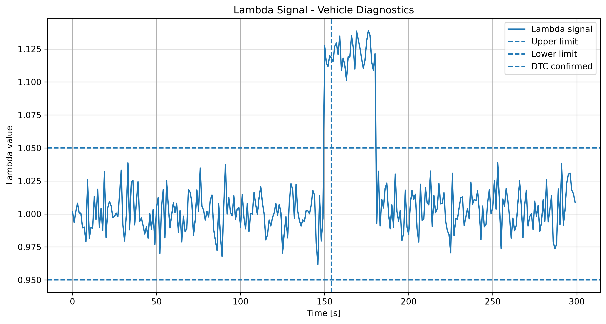
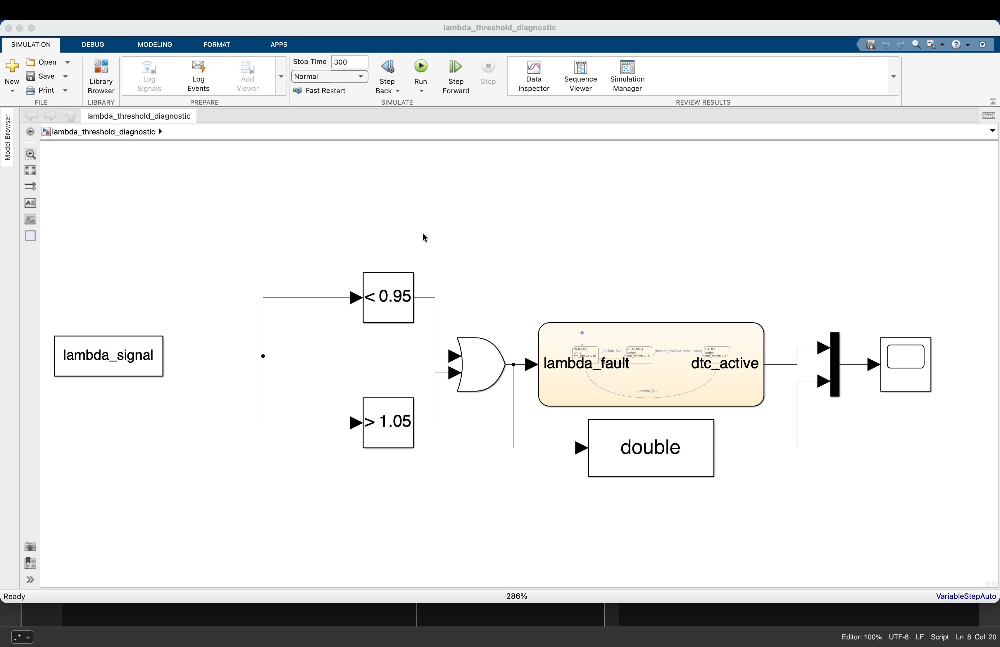
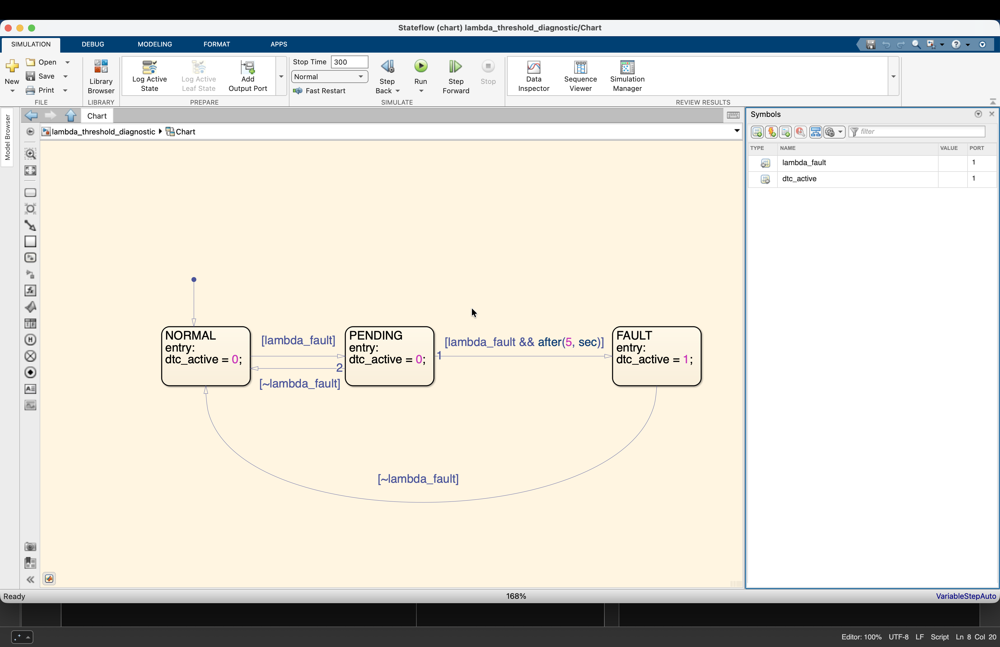
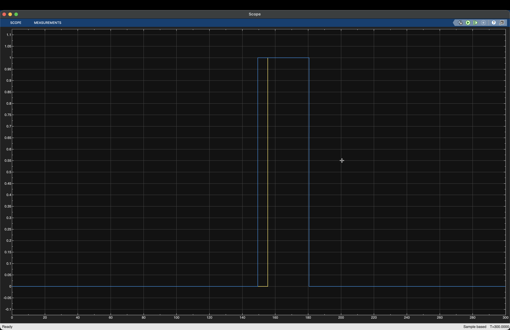

# Vehicle Diagnostics Project

A small vehicle diagnostics project using Python, MATLAB, Simulink and Stateflow.

The project simulates vehicle measurement data and implements a diagnostic workflow for detecting abnormal sensor behavior.

## Project Overview

The diagnostic workflow consists of:

1. Generation of simulated vehicle measurement data
2. Visualization and analysis in Python
3. Threshold-based fault detection
4. Automatic diagnostic report generation
5. MATLAB data analysis
6. Simulink threshold diagnostics
7. Stateflow fault confirmation logic

## Simulated Vehicle Signals

The generated dataset contains:

- Engine speed [rpm]
- Vehicle speed [km/h]
- Coolant temperature [°C]
- Throttle position [%]
- Lambda signal

A simulated lambda fault is introduced between approximately 150 s and 180 s.

## Python Diagnostics

Python is used for data generation, visualization and automatic fault detection.

The diagnostic algorithm monitors the lambda signal and detects values outside the defined range.

Diagnostic thresholds:

- Lower threshold: 0.95
- Upper threshold: 1.05
- Fault confirmation time: 5 s

The diagnostic system also stores measurement values at the time of fault confirmation as simulated freeze-frame data.

## MATLAB Analysis

MATLAB is used to import and analyze the generated vehicle measurement data.

The analysis calculates basic statistics and identifies abnormal lambda measurements.

## Simulink Diagnostics

The Simulink model implements the lambda threshold monitoring using two comparison blocks and logical OR logic.

The resulting `lambda_fault` signal indicates whether the lambda signal is outside the diagnostic range.

## Stateflow Fault Logic

Stateflow implements three diagnostic states:

NORMAL → PENDING → FAULT

When the lambda signal exceeds the diagnostic threshold, the system changes from `NORMAL` to `PENDING`.

The fault must remain active for 5 seconds before the system enters the `FAULT` state.

This prevents short signal disturbances from immediately triggering a confirmed diagnostic fault.

## Diagnostic Results

### Python Lambda Analysis

The simulated lambda fault is visible between approximately 150 s and 180 s.



### Simulink Diagnostic Model

The Simulink model monitors the lambda signal using upper and lower threshold comparisons.



### Stateflow Diagnostic State Machine

The Stateflow logic introduces a pending state before a diagnostic fault is confirmed.



### Fault Confirmation

The blue signal represents the detected threshold violation (`lambda_fault`).

The yellow signal represents the confirmed diagnostic fault (`dtc_active`).  
The delay between both signals demonstrates the 5-second fault confirmation logic.



## Technologies

- Python
- NumPy
- pandas
- Matplotlib
- MATLAB
- Simulink
- Stateflow
- Git

## Project Structure

```text
vehicle-diagnostics-project/
├── data/
├── matlab/
├── python/
├── results/
├── simulink/
├── README.md
└── requirements.txt